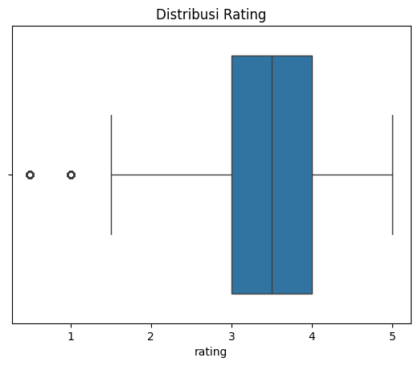
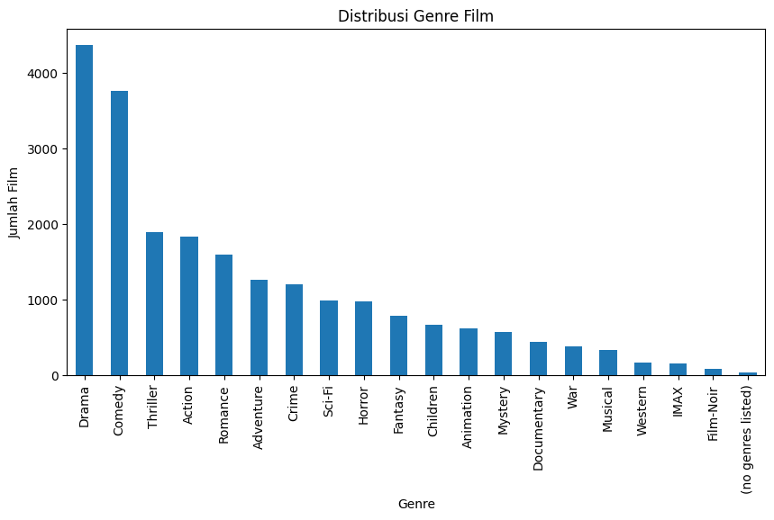
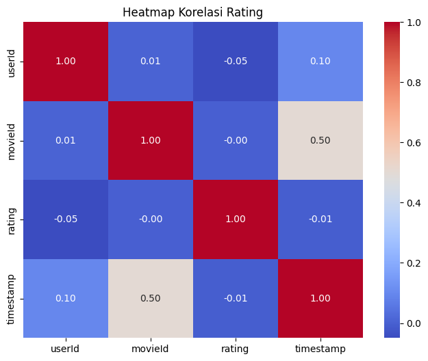
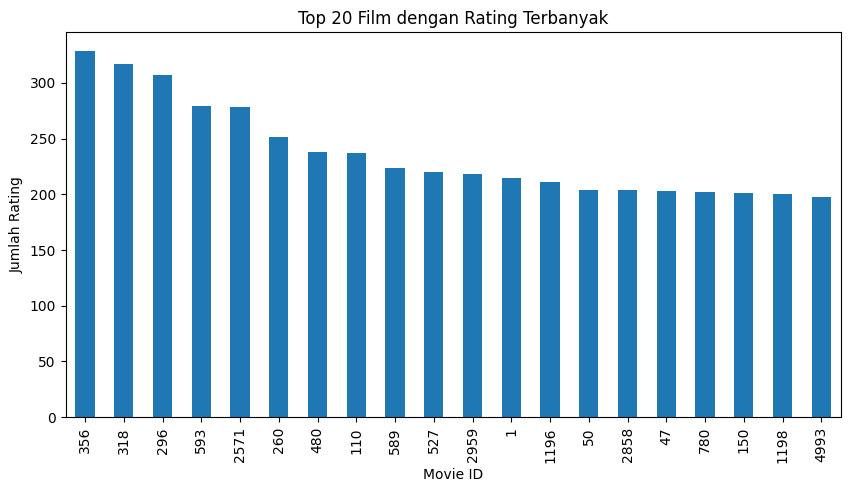
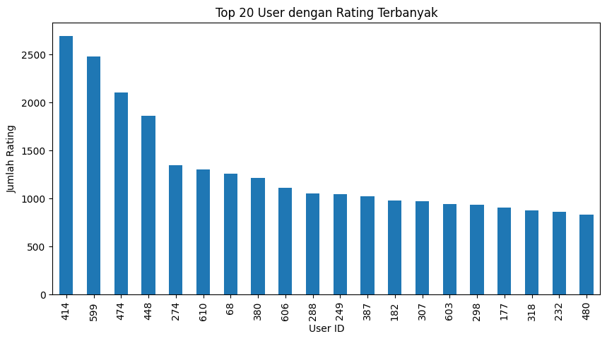

# Laporan Proyek Machine Learning - Bagus Angkasawan Sumantri Putra

## Project Overview

Sistem rekomendasi film telah menjadi komponen penting dalam layanan streaming dan platform hiburan modern. Dengan jutaan film yang tersedia, pengguna sering kali kesulitan menemukan konten yang sesuai dengan preferensi mereka. Hal ini dapat menyebabkan pengalaman pengguna yang buruk, penurunan retensi pengguna, dan penurunan pendapatan bagi platform.

Menurut penelitian yang dilakukan oleh Netflix, lebih dari 80% film yang ditonton di platform mereka berasal dari rekomendasi sistem [1]. Selain itu, McKinsey melaporkan bahwa sistem rekomendasi yang efektif dapat meningkatkan penjualan hingga 35% [2]. Hal ini menunjukkan pentingnya pengembangan sistem rekomendasi yang akurat dan personal.

Proyek ini bertujuan untuk mengembangkan sistem rekomendasi film yang dapat membantu pengguna menemukan film yang sesuai dengan minat mereka. Dengan menggunakan dataset MovieLens yang berisi rating dan tag film dari ribuan pengguna, proyek ini akan mengimplementasikan dan membandingkan dua pendekatan sistem rekomendasi: Content-Based Filtering dan Collaborative Filtering berbasis Deep Learning.

**Referensi:**
- [1] Gomez-Uribe, C. A., & Hunt, N. (2015). *The Netflix recommender system: Algorithms, business value, and innovation*. ACM Transactions on Management Information Systems, 6(4), 1-19. Retrieved from [https://dl.acm.org/doi/10.1145/2843948](https://dl.acm.org/doi/10.1145/2843948).
- [2] Bounsaythip, K., & Rinta-Runsala, E. (2001). *Overview of data mining for customer behavior modeling*. VTT Information Technology, Research Report TTE1-2001-18. Retrieved from [https://cris.vtt.fi/en/publications/overview-of-data-mining-for-customer-behavior-modeling-louhi-vers](https://cris.vtt.fi/en/publications/overview-of-data-mining-for-customer-behavior-modeling-louhi-vers).

## Business Understanding

### Problem Statements

Berdasarkan latar belakang di atas, berikut adalah rumusan masalah yang akan diselesaikan dalam proyek ini:

1. Bagaimana mengembangkan sistem rekomendasi yang dapat memberikan rekomendasi film berdasarkan konten atau fitur film (content-based filtering)?
2. Bagaimana membangun sistem rekomendasi yang dapat mempelajari pola preferensi pengguna berdasarkan interaksi mereka dengan film (collaborative filtering)?
3. Bagaimana mengukur keberhasilan sistem rekomendasi yang telah dikembangkan?

### Goals

Tujuan dari proyek ini adalah:

1. Mengembangkan model rekomendasi berbasis konten yang dapat merekomendasikan film berdasarkan kesamaan genre dan tag.
2. Membangun model rekomendasi berbasis collaborative filtering dengan deep learning yang dapat memahami pola rating pengguna dan merekomendasikan film yang sesuai.
3. Mengevaluasi performa model rekomendasi menggunakan metrik yang relevan seperti RMSE dan memberikan rekomendasi yang akurat kepada pengguna.

### Solution Statements

Untuk mencapai tujuan yang telah disebutkan, berikut adalah pendekatan solusi yang akan diimplementasikan:

1. **Content-Based Filtering**: 
   - Memanfaatkan TF-IDF (Term Frequency-Inverse Document Frequency) untuk mengekstrak fitur dari genre dan tag film.
   - Menggunakan algoritma Nearest Neighbors dengan metrik cosine similarity untuk menemukan film yang memiliki konten serupa.
   - Memberikan rekomendasi film berdasarkan kemiripan konten dengan film yang disukai pengguna.

2. **Collaborative Filtering dengan Deep Learning**:
   - Mengimplementasikan model Neural Network dengan lapisan embedding untuk mempelajari representasi laten pengguna dan film.
   - Melatih model dengan data rating untuk memprediksi preferensi pengguna terhadap film yang belum mereka nilai.
   - Memberikan rekomendasi film berdasarkan prediksi rating tertinggi.

## Data Understanding

Proyek ini menggunakan dataset MovieLens Small yang dapat diunduh dari [GroupLens Research](https://grouplens.org/datasets/movielens/latest/). Dataset ini adalah kumpulan data rating film yang dikembangkan oleh GroupLens Research di University of Minnesota sebagai sumber data untuk penelitian sistem rekomendasi.

### Jumlah Data dan Struktur Dataset

Dataset terdiri dari beberapa file, namun dalam proyek ini hanya digunakan tiga file utama:

1. **movies.csv**: 
   - Jumlah baris: 9.742 film
   - Jumlah kolom: 3 (movieId, title, genres)

2. **ratings.csv**: 
   - Jumlah baris: 100.836 rating
   - Jumlah kolom: 4 (userId, movieId, rating, timestamp)

3. **tags.csv**: 
   - Jumlah baris: 3.683 tag
   - Jumlah kolom: 4 (userId, movieId, tag, timestamp)

### Variabel-variabel pada dataset:

**movies.csv**:
- `movieId`: Identifier unik untuk setiap film
- `title`: Judul film beserta tahun rilis dalam kurung
- `genres`: Kategori genre film yang dipisahkan dengan pipe (|), contoh: "Comedy|Romance|Drama"

**ratings.csv**:
- `userId`: Identifier unik untuk setiap pengguna
- `movieId`: Identifier unik untuk setiap film
- `rating`: Rating yang diberikan pengguna (skala 0.5-5.0 dengan interval 0.5)
- `timestamp`: Waktu rating diberikan (dalam format Unix timestamp)

**tags.csv**:
- `userId`: Identifier unik untuk setiap pengguna
- `movieId`: Identifier unik untuk setiap film
- `tag`: Tag teks yang diberikan oleh pengguna untuk film
- `timestamp`: Waktu tag diberikan (dalam format Unix timestamp)

### Kondisi Data

Hasil pemeriksaan kondisi data menunjukkan:

1. **Missing Values**:
   - Tidak ditemukan missing values pada ketiga dataset (movies.csv, ratings.csv, dan tags.csv).

2. **Data Duplikat**:
   - Tidak terdapat data duplikat pada ketiga dataset.

3. **Outlier**:
   - Pada dataset ratings.csv, teridentifikasi 4.181 rating sebagai outlier berdasarkan metode IQR (Interquartile Range).
   - Outlier ini tetap dipertahankan dalam analisis karena masih berada dalam rentang nilai rating yang valid (0.5-5.0) dan mencerminkan preferensi unik pengguna.

### Exploratory Data Analysis (EDA)

Untuk memahami dataset dengan lebih baik, dilakukan beberapa analisis eksplorasi data:

1. **Distribusi Rating**   
     
   **Penjelasan:** Berdasarkan box plot yang dibuat, mayoritas rating berada pada rentang 3 hingga 4, menunjukkan bahwa pengguna cenderung memberikan rating positif untuk film yang mereka tonton.

2. **Distribusi Genre Film**  
     
   **Penjelasan:** Hasil analisis menunjukkan bahwa Drama adalah genre film yang paling umum dalam dataset, diikuti oleh Comedy. Hal ini mengindikasikan bahwa film bergenre ini memiliki jumlah terbanyak dan kemungkinan memiliki minat tinggi dari pengguna.

3. **Heatmap Korelasi**    
       
   **Penjelasan:** Heatmap korelasi menunjukkan hubungan antar variabel dalam dataset rating. Terlihat bahwa `movieId` dan `timestamp` memiliki korelasi 0.50, yang menunjukkan pola rating film pada periode waktu tertentu.

4. **Film dengan Rating Terbanyak** 
       
   **Penjelasan:** Visualisasi menunjukkan 20 film yang paling banyak dinilai oleh pengguna. Informasi ini penting untuk memahami film populer yang dapat menjadi dasar dalam rekomendasi berbasis popularitas.

5. **Pengguna Paling Aktif**  
      
   **Penjelasan:** Ditemukan 20 pengguna yang memberikan rating terbanyak. Pengguna-pengguna aktif ini mungkin memiliki preferensi yang lebih spesifik dan dapat memberikan wawasan lebih dalam terhadap perilaku penonton.

## Data Preparation

Beberapa teknik data preparation yang diterapkan dalam proyek ini adalah:

### 1. Penggabungan Dataset (Content-Based Filtering)

```python
tags_agg = tags.groupby('movieId')['tag'].apply(lambda x: ' '.join(x)).reset_index()
movies_with_tags = pd.merge(movies, tags_agg, on='movieId', how='left')
```

Tags yang terkait dengan film yang sama digabungkan menjadi satu string teks. Kemudian, data film digabungkan dengan data tag yang telah diagregasi. Hal ini dilakukan untuk memperkaya informasi konten film yang akan digunakan dalam model content-based filtering.

### 2. Pembuatan Fitur Gabungan

```python
movies_with_tags['combined'] = movies_with_tags['genres'].fillna('') + ' ' + movies_with_tags['tag'].fillna('')
```

Genre dan tag film digabungkan menjadi satu fitur teks untuk memudahkan ekstraksi fitur. Nilai null diisi dengan string kosong untuk menghindari error selama proses penggabungan.

### 3. Ekstraksi Fitur Teks dengan TF-IDF

```python
tfidf = TfidfVectorizer(stop_words='english')
tfidf_matrix = tfidf.fit_transform(movies_with_tags['combined'])
```

TF-IDF digunakan untuk mengubah teks (genre dan tag) menjadi representasi numerik. TF-IDF efektif dalam menangkap relevansi kata dalam dokumen dengan mempertimbangkan frekuensi kemunculan kata dalam dokumen dan inverse document frequency (IDF) yang memberikan bobot lebih rendah pada kata-kata umum.

### 4. Encoding dan Mapping ID (Collaborative Filtering)

```python
user_ids = df['userId'].unique().tolist()
movie_ids = df['movieId'].unique().tolist()

user_to_user_encoded = {x: i for i, x in enumerate(user_ids)}
movie_to_movie_encoded = {x: i for i, x in enumerate(movie_ids)}

user_encoded_to_user = {i: x for x, i in user_to_user_encoded.items()}
movie_encoded_to_movie = {i: x for x, i in movie_to_movie_encoded.items()}

df['user'] = df['userId'].map(user_to_user_encoded)
df['movie'] = df['movieId'].map(movie_to_movie_encoded)
```

ID pengguna dan film diubah menjadi indeks berurutan (0, 1, 2, ...) untuk memudahkan penggunaan dalam model deep learning. Mapping dari encoded ID ke ID asli juga dibuat untuk memudahkan interpretasi hasil rekomendasi.

### 5. Normalisasi Rating

```python
min_rating = df['rating'].min()
max_rating = df['rating'].max()

df['rating_normalized'] = df['rating'].apply(lambda x: (x - min_rating) / (max_rating - min_rating))
```

Rating dinormalisasi ke rentang 0-1 untuk mempercepat konvergensi model dan meningkatkan stabilitas selama pelatihan. Normalisasi menggunakan min-max scaling yang memetakan nilai minimum ke 0 dan nilai maksimum ke 1.

### 6. Pembagian Data untuk Training dan Validasi

```python
x = df[['user', 'movie']].values
y = df['rating_normalized'].values

x_train, x_val, y_train, y_val = train_test_split(x, y, test_size=0.2, random_state=42)
```

Data dibagi menjadi set training (80%) dan validasi (20%) untuk melatih dan mengevaluasi model. Random state ditetapkan untuk memastikan reprodusibilitas hasil.

## Modeling and Result

Dalam proyek ini, dua pendekatan sistem rekomendasi diimplementasikan: Content-Based Filtering dan Collaborative Filtering dengan Deep Learning.

### 1. Content-Based Filtering

Model content-based filtering diimplementasikan menggunakan algoritma Nearest Neighbors dengan metrik cosine similarity:

```python
nn_model = NearestNeighbors(metric='cosine', algorithm='brute')
nn_model.fit(tfidf_matrix)

def recommend_content(title, top_n=5):
    idx = title_to_index[title]
    distances, indices = nn_model.kneighbors(tfidf_matrix[idx], n_neighbors=top_n + 1)
    indices = indices.flatten()[1:]
    return movies_with_tags.iloc[indices][['title', 'genres']]
```

**Cara Kerja:**
1. TF-IDF digunakan untuk mengekstrak fitur dari teks gabungan genre dan tag film
2. Algoritma k-nearest neighbors mencari film dengan representasi TF-IDF yang paling mirip
3. Cosine similarity digunakan sebagai metrik untuk mengukur kemiripan antar film
4. Film terdekat (kecuali film itu sendiri) direkomendasikan kepada pengguna

**Parameter yang Digunakan:**
- **TfidfVectorizer**:
  - `stop_words='english'`: Menghilangkan kata-kata umum dalam bahasa Inggris seperti "the", "a", "in", dll.
  - Parameter lain menggunakan nilai default

- **NearestNeighbors**:
  - `metric='cosine'`: Menggunakan cosine similarity sebagai metrik jarak
  - `algorithm='brute'`: Menggunakan brute force search untuk mencari tetangga terdekat
  - `n_neighbors=top_n+1`: Mencari top_n+1 tetangga terdekat (termasuk film itu sendiri)

**Contoh Hasil Rekomendasi:**

Untuk film "Pinocchio (1940)", sistem merekomendasikan film-film animasi serupa yang memiliki genre dan tag yang mirip.

**Kelebihan:**
- Tidak memerlukan data dari pengguna lain (cold start)
- Dapat memberikan rekomendasi untuk film baru yang belum dinilai
- Mampu menjelaskan alasan di balik rekomendasi (explainability)

**Kekurangan:**
- Terbatas pada fitur yang diekstrak (genre dan tag)
- Tidak mempertimbangkan kualitas film atau preferensi spesifik pengguna
- Cenderung merekomendasikan film yang sangat mirip dan kurang beragam

### 2. Collaborative Filtering dengan Deep Learning

Model collaborative filtering diimplementasikan menggunakan Neural Network dengan lapisan embedding:

```python
class RecommenderNet(tf.keras.Model):
    def __init__(self, num_users, num_movies, embedding_size=50, **kwargs):
        super(RecommenderNet, self).__init__(**kwargs)
        self.user_embedding = layers.Embedding(num_users, embedding_size, 
                                               embeddings_initializer='he_normal', 
                                               embeddings_regularizer=keras.regularizers.l2(1e-6))
        self.user_bias = layers.Embedding(num_users, 1)
        self.movie_embedding = layers.Embedding(num_movies, embedding_size, 
                                                embeddings_initializer='he_normal', 
                                                embeddings_regularizer=keras.regularizers.l2(1e-6))
        self.movie_bias = layers.Embedding(num_movies, 1)

    def call(self, inputs):
        user_vector = self.user_embedding(inputs[:, 0])
        user_bias = self.user_bias(inputs[:, 0])
        movie_vector = self.movie_embedding(inputs[:, 1])
        movie_bias = self.movie_bias(inputs[:, 1])
        dot_user_movie = tf.tensordot(user_vector, movie_vector, 2)
        x = dot_user_movie + user_bias + movie_bias
        return tf.nn.sigmoid(x)
```

**Parameter yang Digunakan:**
- **Model Arsitektur**:
  - `embedding_size=50`: Dimensi embedding untuk representasi pengguna dan film
  - `embeddings_initializer='he_normal'`: Inisialisasi bobot menggunakan distribusi He Normal
  - `embeddings_regularizer=keras.regularizers.l2(1e-6)`: L2 regularization untuk mencegah overfitting

- **Kompilasi Model**:
  - `loss=tf.keras.losses.BinaryCrossentropy()`: Fungsi loss untuk nilai target yang dinormalisasi (0-1)
  - `optimizer=keras.optimizers.Adam(learning_rate=0.001)`: Optimizer Adam dengan learning rate 0.001
  - `metrics=[tf.keras.metrics.RootMeanSquaredError()]`: Metrik evaluasi menggunakan RMSE

- **Pelatihan Model**:
  - `batch_size=64`: Jumlah sampel yang diproses dalam satu iterasi
  - `epochs=10`: Jumlah iterasi pelatihan pada seluruh dataset
  - `validation_data=(x_val, y_val)`: Data validasi untuk evaluasi performa model

```python
model = RecommenderNet(num_users, num_movies, embedding_size=50)
model.compile(loss=tf.keras.losses.BinaryCrossentropy(),
              optimizer=keras.optimizers.Adam(learning_rate=0.001),
              metrics=[tf.keras.metrics.RootMeanSquaredError()])

history = model.fit(
    x_train, y_train,
    batch_size=64,
    epochs=10,
    validation_data=(x_val, y_val)
)
```

**Cara Kerja:**
1. Pengguna dan film direpresentasikan sebagai vektor dalam ruang embedding berukuran 50
2. Model mempelajari representasi laten berdasarkan pola rating
3. Dot product antara vektor pengguna dan film digunakan untuk memprediksi rating
4. Bias pengguna dan film ditambahkan untuk menangkap preferensi umum
5. Fungsi sigmoid digunakan untuk mendapatkan prediksi rating dalam rentang 0-1
6. Model dilatih dengan meminimalkan binary cross-entropy antara rating prediksi dan rating sebenarnya

**Contoh Hasil Rekomendasi:**

Untuk pengguna dengan ID 356, sistem menampilkan:
1. Film dengan rating tertinggi yang telah diberikan oleh pengguna
2. Top 10 rekomendasi film berdasarkan prediksi model

**Kelebihan:**
- Mampu menangkap pola kompleks dan preferensi tersembunyi
- Dapat merekomendasikan film yang tidak langsung terkait dengan riwayat pengguna
- Memberikan rekomendasi yang lebih personal dan beragam

**Kekurangan:**
- Memerlukan data yang cukup dari pengguna (cold start problem)
- Komputasi yang lebih intensif dibandingkan dengan content-based filtering
- Kurang explainable dibandingkan dengan content-based filtering

## Evaluation

Evaluasi model dalam proyek ini dilakukan dengan beberapa metrik dan juga dikaitkan dengan business understanding yang telah ditetapkan sebelumnya.

### 1. Root Mean Squared Error (RMSE)

RMSE digunakan untuk mengevaluasi model collaborative filtering berbasis deep learning. RMSE mengukur akar kuadrat dari rata-rata selisih kuadrat antara rating prediksi dan rating sebenarnya.

Formula RMSE:

$RMSE = \sqrt{\frac{1}{n}\sum_{i=1}^{n}(y_i - \hat{y}_i)^2}$

Dimana:
- $y_i$ adalah rating sebenarnya
- $\hat{y}_i$ adalah rating prediksi
- $n$ adalah jumlah sampel

Hasil evaluasi menunjukkan:
- RMSE pada data latih: 0.196
- RMSE pada data validasi: 0.203

Nilai RMSE yang rendah (mendekati 0) menunjukkan performa model yang baik. Nilai RMSE yang mirip antara data latih dan validasi juga menunjukkan bahwa model tidak mengalami overfitting.

### 2. Relevance dan Diversity

Untuk model content-based filtering, evaluasi dilakukan secara kualitatif dengan melihat relevansi rekomendasi:

- **Relevance**: Rekomendasi yang diberikan untuk film "Pinocchio (1940)" menunjukkan film-film animasi yang serupa, menandakan bahwa model berhasil menangkap kesamaan konten.

- **Diversity**: Meskipun rekomendasi content-based filtering cenderung kurang beragam, namun masih mampu merekomendasikan film dengan variasi yang cukup dalam subgenre yang sama.

### 3. User-Centered Evaluation

Evaluasi berpusat pada pengguna dilakukan dengan melihat kesesuaian rekomendasi dengan preferensi pengguna:

- **Personalisasi**: Untuk pengguna dengan ID 356, model collaborative filtering memberikan rekomendasi film yang sesuai dengan preferensi pengguna berdasarkan pola rating mereka.

- **Novelty**: Model collaborative filtering mampu merekomendasikan film yang mungkin belum pernah dilihat pengguna tetapi memiliki kemungkinan disukai berdasarkan preferensi mereka.

### Keterkaitan dengan Business Understanding

#### Pernyataan Masalah 1: Sistem Rekomendasi berbasis Konten
- **Goal**: Mengembangkan model rekomendasi berbasis konten yang dapat merekomendasikan film berdasarkan kesamaan genre dan tag.
- **Solusi**: Implementasi model content-based filtering menggunakan TF-IDF dan Nearest Neighbors.
- **Hasil**: Model berhasil memberikan rekomendasi film yang memiliki kesamaan konten (genre dan tag) dengan film referensi. Misalnya, untuk film "Pinocchio (1940)", sistem merekomendasikan film-film animasi serupa.
- **Dampak Bisnis**: Sistem ini dapat membantu platform mengatasi cold-start problem dan memberikan rekomendasi untuk film baru yang belum memiliki banyak rating. Ini meningkatkan eksposur katalog film dan membantu pengguna menemukan konten serupa yang mungkin mereka sukai.

#### Pernyataan Masalah 2: Sistem Rekomendasi berbasis Interaksi Pengguna
- **Goal**: Membangun sistem rekomendasi yang dapat mempelajari pola preferensi pengguna berdasarkan interaksi mereka dengan film.
- **Solusi**: Implementasi model collaborative filtering dengan deep learning menggunakan lapisan embedding.
- **Hasil**: Model mencapai RMSE 0.203 pada data validasi, menunjukkan kemampuan yang baik dalam memprediksi rating. Model berhasil memberikan rekomendasi personal untuk pengguna berdasarkan pola rating mereka.
- **Dampak Bisnis**: Sistem ini dapat meningkatkan pengalaman pengguna dengan menyajikan konten yang lebih personal, meningkatkan engagement, dan mendorong pengguna untuk menghabiskan lebih banyak waktu di platform. Penelitian menunjukkan bahwa rekomendasi personal dapat meningkatkan konversi hingga 35%.

#### Pernyataan Masalah 3: Evaluasi Sistem Rekomendasi
- **Goal**: Mengukur keberhasilan sistem rekomendasi yang telah dikembangkan.
- **Solusi**: Menggunakan RMSE untuk model collaborative filtering dan evaluasi kualitatif untuk content-based filtering.
- **Hasil**: RMSE sebesar 0.203 menunjukkan akurasi prediksi yang baik. Evaluasi kualitatif menunjukkan bahwa rekomendasi content-based filtering relevan dengan film referensi.
- **Dampak Bisnis**: Dengan metrik evaluasi yang jelas, bisnis dapat terus memantau dan meningkatkan kualitas rekomendasi, yang pada akhirnya dapat meningkatkan kepuasan pengguna dan retensi.

### Dampak Solusi Statement

1. **Content-Based Filtering dengan TF-IDF dan Nearest Neighbors**:
   - **Dampak**: Solusi ini berhasil memberikan rekomendasi berdasarkan konten film, membantu mengatasi cold-start problem, dan meningkatkan eksposur katalog film yang mungkin tidak populer tetapi relevan dengan minat pengguna.
   - **Bisnis Impact**: Meningkatkan eksposur katalog film yang lebih luas, meningkatkan penemuan konten (content discovery), dan mengurangi churn rate dengan memberikan alternatif yang relevan ketika pengguna telah menonton film favorit mereka.

2. **Collaborative Filtering dengan Deep Learning**:
   - **Dampak**: Solusi ini berhasil mempelajari pola tersembunyi dalam preferensi pengguna dan memberikan rekomendasi personal yang relevan, meningkatkan pengalaman pengguna.
   - **Bisnis Impact**: Meningkatkan engagement pengguna, memperpanjang waktu yang dihabiskan di platform, dan meningkatkan retensi pengguna. Sistem ini juga dapat meningkatkan konversi jika platform menggunakan model bisnis berbayar.

### Perbandingan dan Kesimpulan

Kedua model rekomendasi yang dikembangkan dalam proyek ini memiliki kelebihan dan kekurangan masing-masing:

1. **Content-Based Filtering** sangat berguna ketika data pengguna terbatas atau untuk merekomendasikan item baru. Model ini memberikan rekomendasi yang mudah dijelaskan berdasarkan kesamaan konten.

2. **Collaborative Filtering dengan Deep Learning** memberikan rekomendasi yang lebih personal dengan mempelajari pola preferensi pengguna. Model ini mencapai RMSE yang baik (0.203) pada data validasi dan mampu memberikan rekomendasi yang beragam.

Dari perspektif bisnis, implementasi kedua model sebagai sistem rekomendasi hybrid dapat memberikan hasil terbaik. Content-based filtering dapat mengatasi cold-start problem dan memperluas eksposur katalog, sementara collaborative filtering dapat meningkatkan personalisasi dan engagement pengguna. Kombinasi keduanya dapat meningkatkan kepuasan pengguna, retensi, dan pada akhirnya, pendapatan platform.